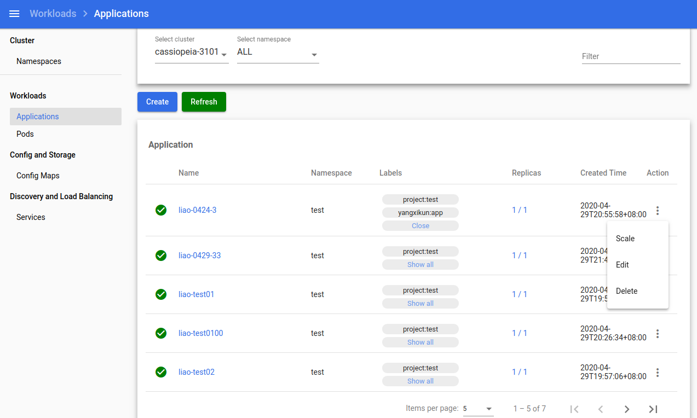
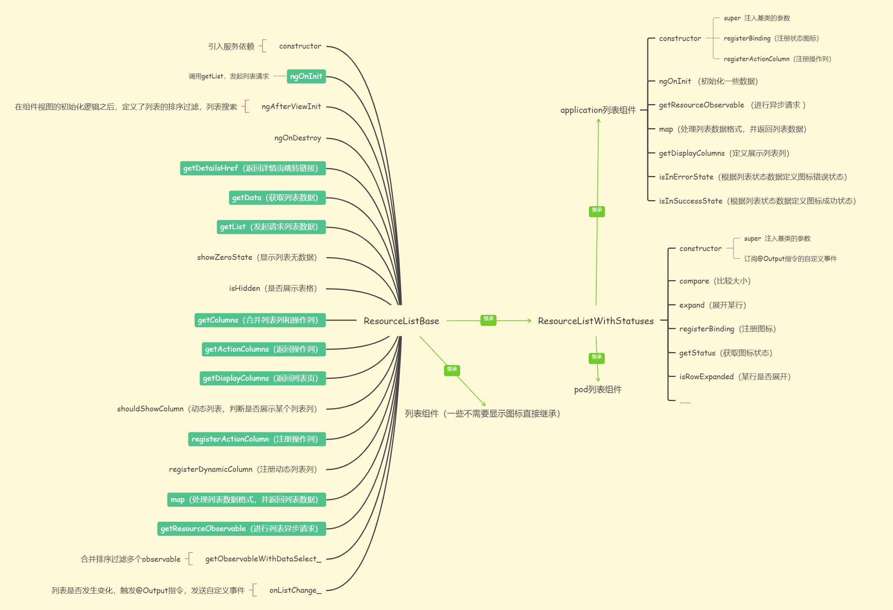
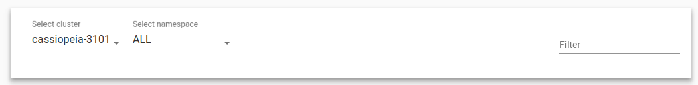
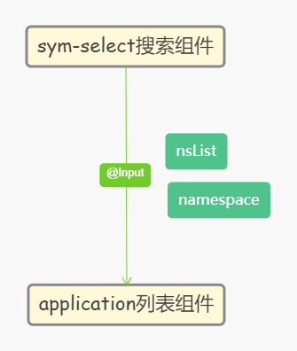
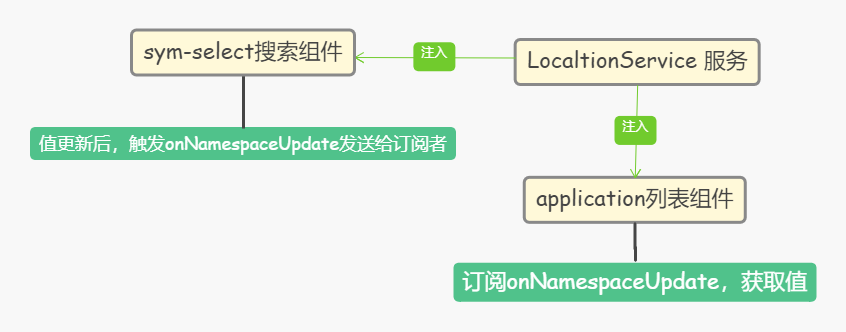
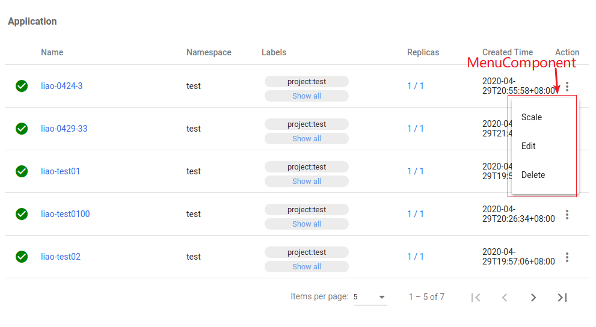
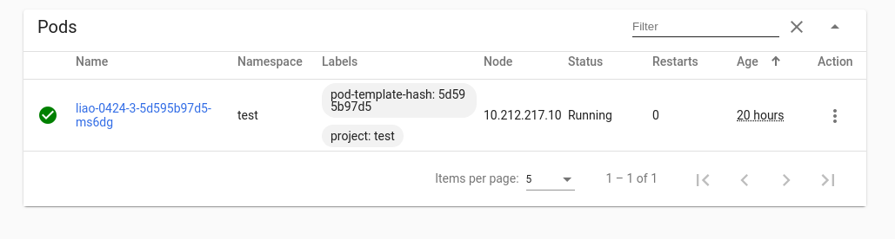

# 基于列表类开发的列表组件

## 这只是部分代码，仅作参考

## 主要实现的功能

​	排序、分页、过滤、自定义操作列、列表中根据数据展示相应图标、跳转详情页



​	

## 组件继承思想

​	封装一个列表基类，派生类继承该类，复用基类的功能。

##### Constructor 构造函数

​	如果派生类未声明构造函数，它将使用基类的构造函数。这意味着在基类构造函数注入的所有服务，子组件都能访问到。

##### 生命周期方法不继承

​	如果基类中包含生命周期钩子，如 ```ngOnInit```、```ngOnChanges``` 等，而在派生类没有定义相应的生命周期钩子，基类的生命周期钩子会被自动调用。如果需要在派生类触发```ngOnInit```，则需要在派生类上定义相应的生命周期钩子。

##### 继承的方法和属性基于可访问性级别

​	派生类不能访问私有方法和属性，仅继承公共方法和属性。

##### 模板是不能被继承

​	模板是不能被继承的 ，派生类需自定义模板，因此共享的 DOM 结构或行为需要单独处理。

##### 元数据和装饰器不继承

装饰器和元数据（```@Component```，```@Directive```，```@NgModule```等），这些元数据和装饰器不会被派生类继承，但是有一个例外，```@Input```和```@Output```装饰器会传递给派生类

##### 依赖注入

派生类必须通过调用super注入基类的参数

## 实现过程

application列表组件和基类```ResourceListBase```、```ResourceListWithStatuses``` 关系



application列表组件主要继承父类```ResourceListWithStatuses```，通过重写```ResourceListWithStatuses```的方法，自定义模板，来复用父类的功能属性。

#### 组件定义

##### 自定义模板

```ts
@Component({
  selector: 'sym-application-list',
  templateUrl: './application.component.html',
  changeDetection: ChangeDetectionStrategy.OnPush,
})
```


##### 继承父类
通过expends继承父类


##### 重写父类方法

通过继承基类```ResourceListWithStatuses```，可以复用其基本的功能属性，同时可以定义属性和方法扩展列表组件的功能，实现这个列表组件主要的是如果**调用组件方法发起请求，获取到数据**

- 重写```getResourceObservable``` 方法，该方法主要是返回一个Observable，进行异步编程。

  在这个方法里，可以请求多个api，使用Observable.forkJoin，可以合并多个Observable，返回一个Observable。

- 结合```sym-select``` 组件搜索

  

  ```sym-select```组件的namespace下拉列表的数据nsList是异步获取的，如果是选择是的namespace是ALL，那么列表组件要获取到nsList，然后对每个nsList里的namespace进行全部请求。如果选择的是某个namesapce，那么就传入namespace的值，进行单个请求

  **这里也是比较疑惑的地方**，之前想通过```@Input```传入属性的方式，来把搜索组件的数据传递给applicaiton列表组件```sym-application-list```

  

  但是尝试之后，发现在页面初始化的时候，通过```@Input```的属性传入的```nsList```为空的。如果传入的属性是同步获取的，则可以传递到application列表组件中

  最后获取搜索参数的方式，采取**服务依赖注入**的方式来获取。

  

- 通过重写map 方法，在自定义表格的数据，返回所需表格的数据。

```ts
ngOnInit() {
    this.data_.sortingDataAccessor = (item, property) => {
      switch (property) {
        case 'name': return item.objectMeta.name;
        case 'creationTimestamp': return item.status.creationTimestamp;
        case 'namespace': return item.objectMeta.namespace;
        default: return item[property];
      }
    };
  }

  getResourceObservable(params?: HttpParams): Observable<ApplicationList> {
    const res = this.localtionService_.onNamespaceUpdate.subscribe(() => {
      this.namespace = this.localtionService_.current().namespace;
      this.nsList = this.localtionService_.current().namespaceList;
    });
    const data: any = {
      items: [],
      listMeta: {
        totalItems: 0
      }
    };
    if (this.namespace === 'ALL') {
      const list = this.nsList.slice(1);
      const observableList = list.map((ns: any) => {
        return this.application_.get(this.endpoint, undefined, ns.name);
      });
      if (observableList && observableList.length === 0) {
        return new Observable((observer) => {
          observer.next(data);
        });
      }
      return new Observable((observer) => {
        Observable.forkJoin(observableList).subscribe((res: any) => {
          res.map((item: any, index: number) => {
            item.items = item.items.map((v: any) => {
              v.objectMeta.namespace = list[index].name;
              return v;
            });
            data.items = data.items.concat(item.items);
            data.listMeta.totalItems += item.listMeta.totalItems;
          });
          observer.next(data);
        });
      });
    } else if (this.namespace !== undefined) {
      return this.application_.get(this.endpoint, undefined, this.namespace, params);
    }
    return new Observable((observer) => {
      observer.next(data);
    });
  }

  map(applicationList: ApplicationList): Application[] {
    if (this.namespace !== 'ALL') {
      applicationList.items = applicationList.items.map((v: any) => {
        v.objectMeta.namespace = this.namespace;
        return v;
      });
    }
    console.log('applicationList', applicationList);
    return applicationList.items;
  }

  isInErrorState(resource: Application): boolean {
    return resource.status ? (resource.status.replicas && resource.status.replicas !== resource.status.availableReplicas ?
       true : false) : false;
  }

  isInSuccessState(resource: Application): boolean {
    return resource.status ? (resource.status.replicas && resource.status.replicas === resource.status.availableReplicas ?
       true : false) : false;
  }

  protected getDisplayColumns(): string[] {
    return ['statusicon', 'name', 'namespace', 'labels', 'replicas', 'creationTimestamp'];
  }
```

#### 组件使用

```html
<sym-application-list #applicationList></sym-application-list>
```

初始化时，调用getList请求方法

```ts
this.applicationList.getList();
```

## 公共组件的巧妙之处

##### actionColumn 操作列可以自定义

在基类中已有声明注册操作列的方法，在application列表组件继承该方法，在构造函数中，注册操作列，```MenuComponent```是引入的组件



```
this.registerActionColumn<MenuComponent>('menu', MenuComponent);
```

##### 过滤功能



这里的Pods列表组件也是继承了```ResourceListWithStatuses```

继承的组件都会继承过滤功能，因为继承的组件的模板是自定义的，可以在模板上引入过滤的组件

```html
<kd-card-list-filter></kd-card-list-filter>
```

基类中以判断是否有过滤组件，并订阅过滤组件的方法触发列表过滤

```ts
ngAfterViewInit(): void {
    this.data_.sort = this.matSort_;
    this.data_.paginator = this.matPaginator_;

    if (this.cardFilter_) {
      // 表格搜索
      this.cardFilter_.filterEvent.subscribe(() => {
        const filterValue = this.cardFilter_.query;
        this.data_.filter = filterValue.trim().toLowerCase();
      });
    }
  }
```

## 最后

​	通过继承一些列表组件或者基类，可以大大地提升组件功能的复用率，并且能够提高开发效率。在一些业务场景中，我们总会面临着，多处一样的代码，如果有变动，就要全部更改，这样不利于代码的简洁，而且代码逻辑相对单一。由此我们要学会封装一些常用性的组件，来达到代码的复用率，加强代码的健壮性。